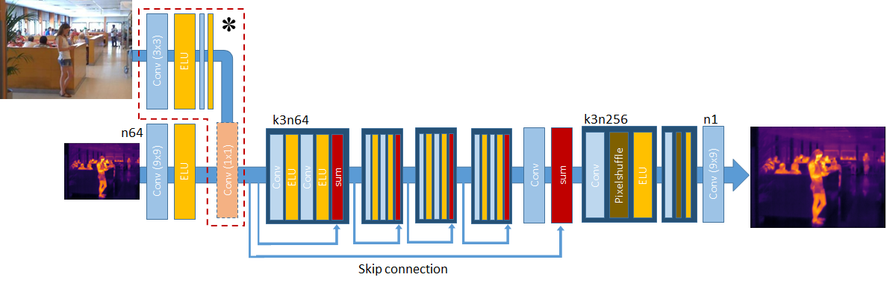

##Multimodal Sensor Fusion In Single Thermal image Super-Resolution  
[MSF-STI-SR](https://arxiv.org/abs/1812.09276v1)  
  
[Feras Almasri](), [Olivier Debeir]()  
  
  
  
#### Samples annotations  
  
57 test samples, each sample has 17 versions represented in the following annotations:   
  
| Anotation | Description                                |  
|-----------|:--------------------------------------------|  
| Bi        | Bicubic interpolated sample                |  
| HR        | High resolution sample                     |  
| LR        | Low                                        |  
| M_1       | TSRCNN                                     |  
| M_2       | VTSRCNN                                    |  
| M_3       | TSRCNN with 16 blocks                      |  
| M_4       | InpDconv-TRSCNNres                         |  
| M_5       | AllDconv-TRSCNNres                         |  
| M_6       | TSRCNN with 10 blocks                      |  
| M_7       | Inpbilinear-TRSCNNres                      |  
| M_8       | Inpbicubic-TRSCNNres                       |  
| M_9       | AllDconv-TSRCNN Trained on upsampled image |  
| M_10      | TSRGAN                                     |  
| M_11      | VTSRGAN                                    |  
| LAPSRN    | Original LAPSRN model                      |  
| VDSR2     | Original VDSR model                        |  
| VDSR3     | VDSRex                                     |  
  
#### Models used in the Color-coded votes flow diagram  
  
| | |  
|-----------|:------------|  
| 1       | M_1        	  |  
| 2       | M_2           |  
| 3       | M_4           |  
| 4       | M_5           |  
| 5       | M_10          |  
| 6       | M_11          |  
| 7       | VDSR2         |  
| 8       | VDSR3         |  
| 9       | LAPSRN        |  

  
#### Citation  
  
@article{almasri2018multimodal,  
  title={Multimodal Sensor Fusion In Single Thermal image Super-Resolution},    
  author={Almasri, Feras and Debeir, Olivier},  
  journal={arXiv preprint arXiv:1812.09276},  
  year={2018}  
}
